# SynthDetect — Flow Sequences

_Last updated: 2026-04-09_

Sequence diagrams (Mermaid) for the most important user journeys.
Render these in any GitHub viewer or VS Code with the Mermaid plugin.

---

## 1. User Registration + Email Verification

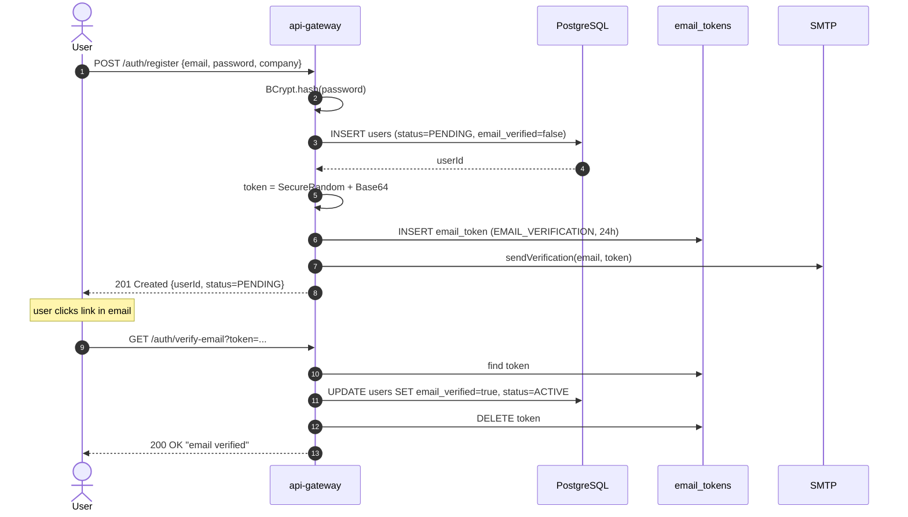

---

## 2. Login → JWT Access + Refresh

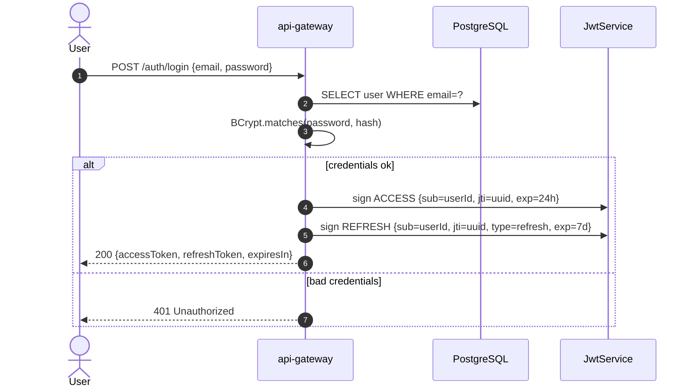

---

## 3. Refresh Token Rotation (with blacklist)

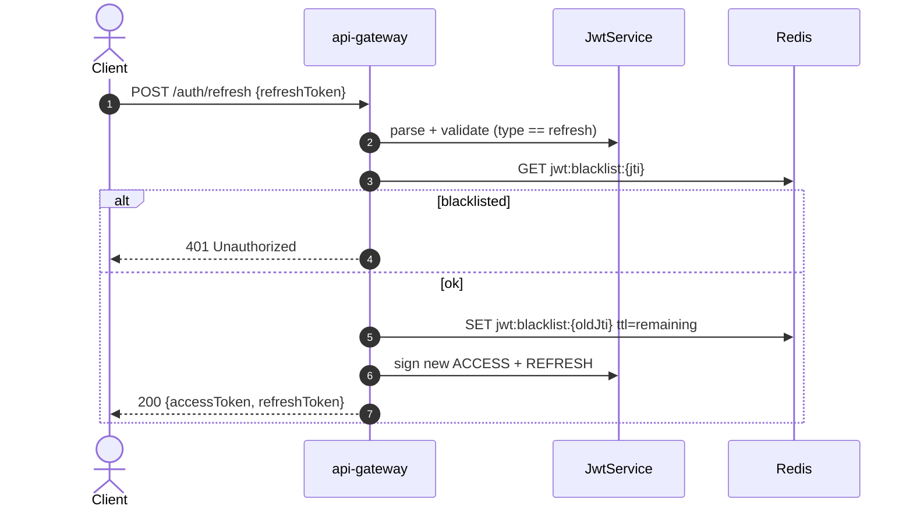

---

## 4. API Key Creation

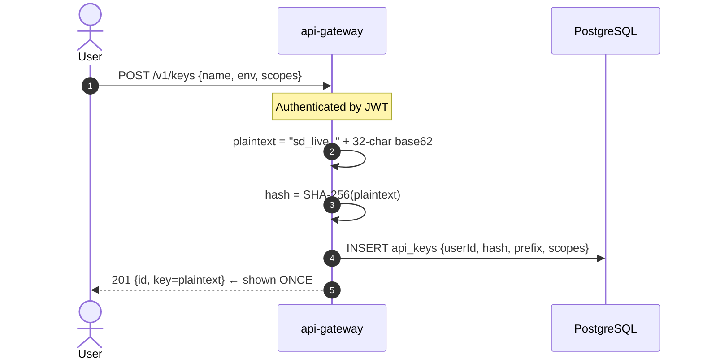

---

## 5. Authenticated Detection Request (API Key Path)

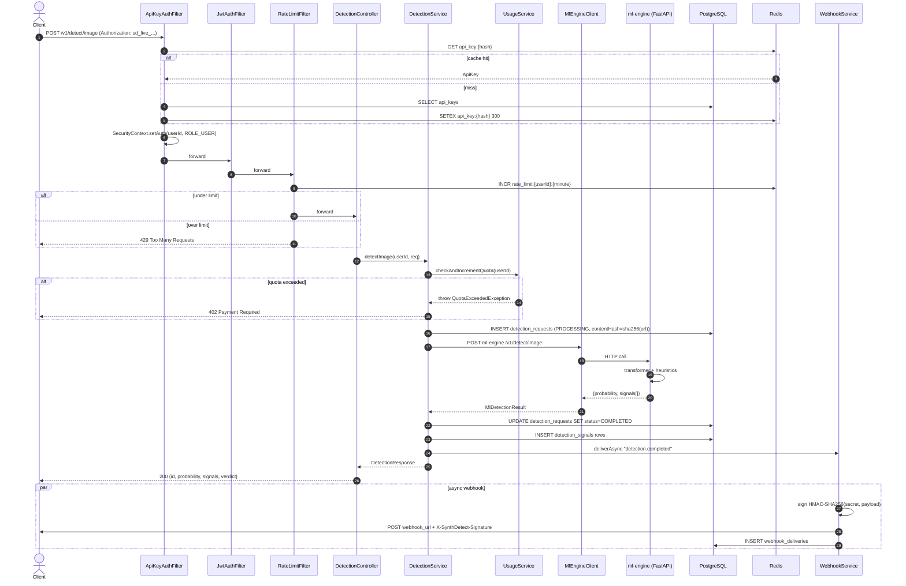

---

## 6. Quota Threshold Event (80% & 100%)

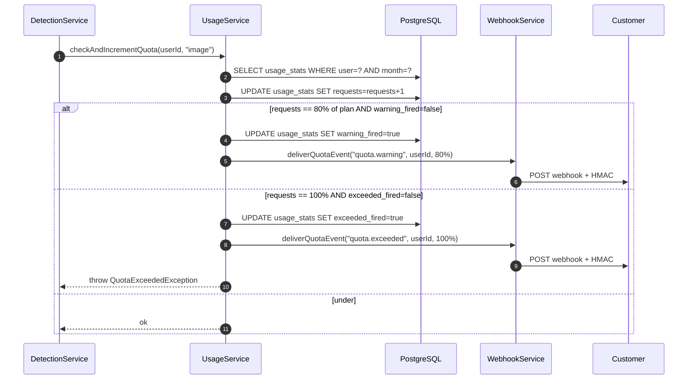

---

## 7. Webhook Delivery (HMAC-signed)

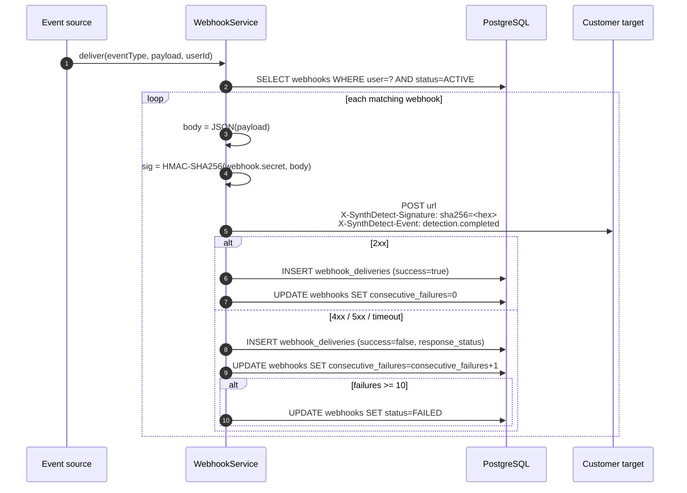

---

## 8. Compliance Takedown (India IT Rules 2026 · 3-hour SLA)

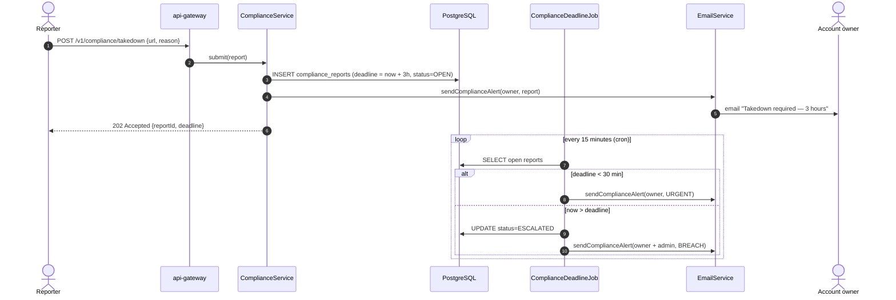

---

## 9. Admin RBAC Flow (@PreAuthorize)

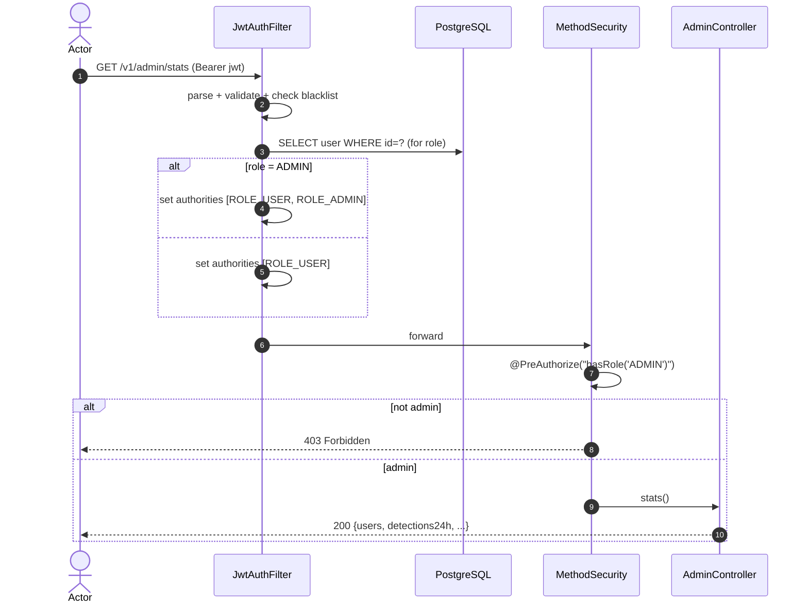

---

## 10. Logout (Blacklist Both Tokens)

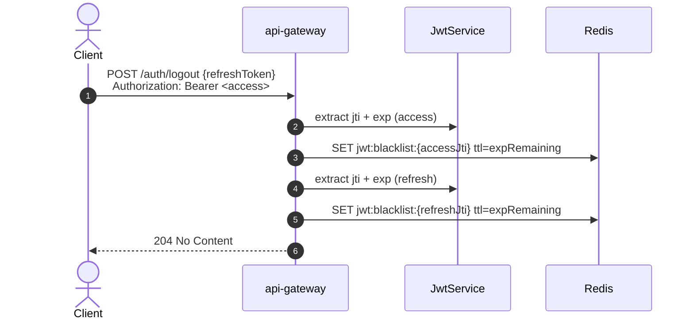

---

## 11. Scheduled Jobs Overview

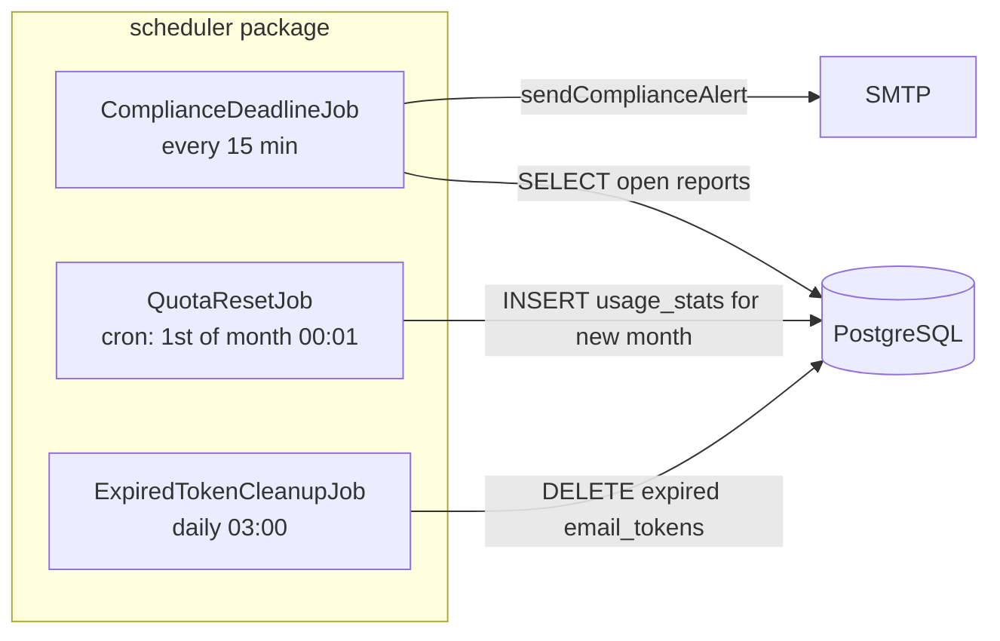

---

## 12. Image Upload Path (Multipart)

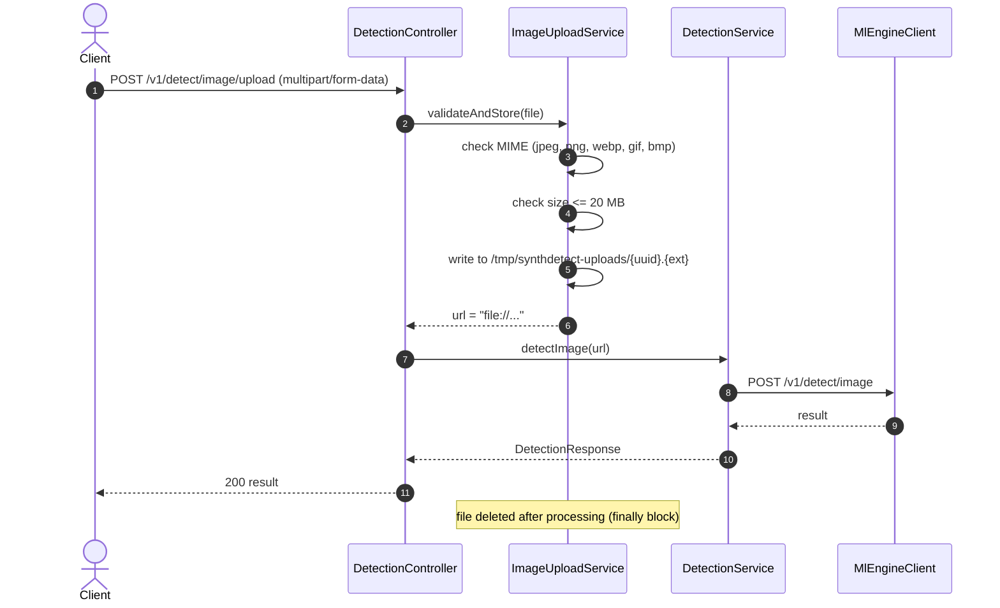
